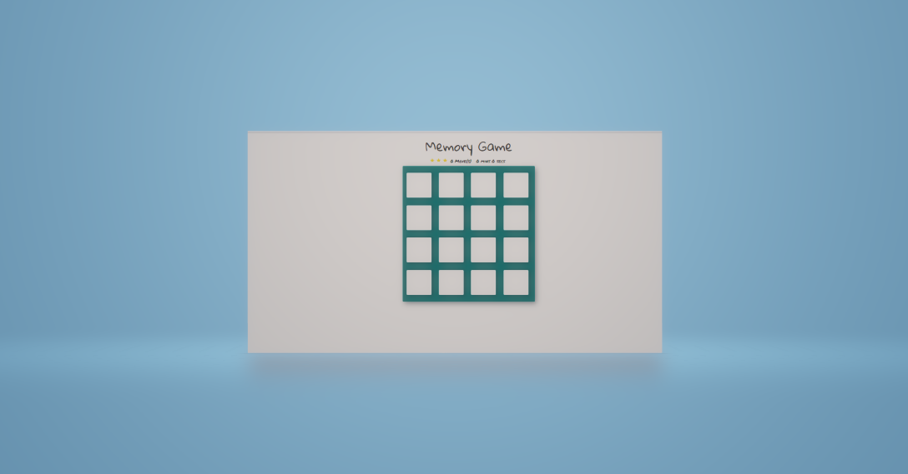

# Memory Game 

## What is the Memory Game
This is a simple game built to test a users memory. There's a deck of cards with different icons. 

## Challenge
Match cards in less time with less moves.

## How to Play
Load this link in your browser https://kwerrell73.github.io/memory-game//

## Instructions
* Click on a card
* Keep revealing cards and working your memory to remember each unveiled card.
* Match cards properly with less moves and in faster time

## How I built the Memory Game
I manipulated the DOM with Vanilla JS, altered part of the HTML and also styled the game
* created a deck of cards that shuffles when game is refreshed
* created a counter to count the number of moves made by player and timer to know the duration of a play
* added effects to cards when they match and are unmatched
* create a pop-up modal when player wins game

## Built With
* HTML
* CSS
* Materalize
* JavaScript

## Website
https://kwerrell73.github.io/memory-game/

## Screenshots

## Contribution
Made with ❤️ by Kellie Werrell

### ©️2021 Portfolio 
